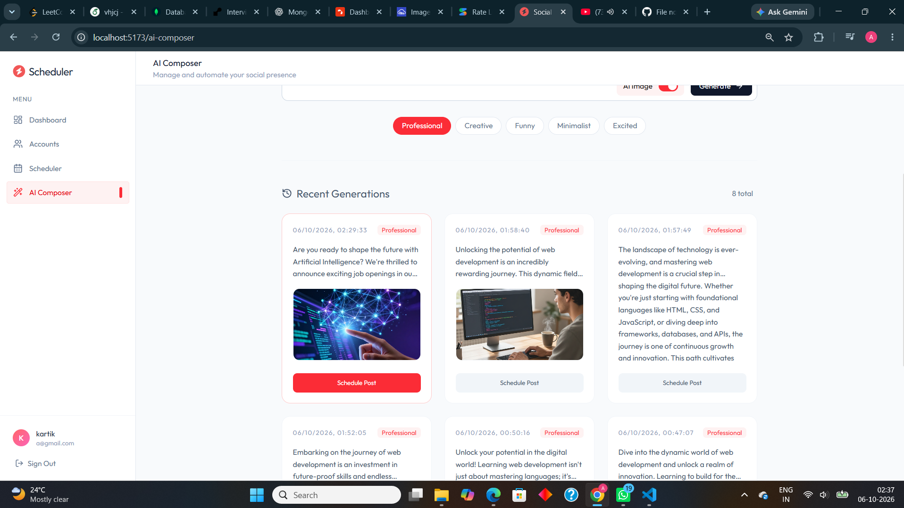
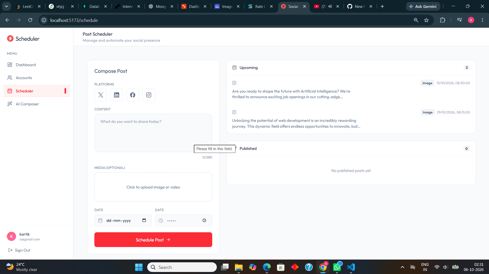

# 🚀 Social Scheduler

An AI-powered social media management and scheduling platform that helps users **generate social media content, create AI-powered images, connect social accounts, schedule posts, and automate publishing** from a single dashboard.

---

## ✨ Features

### 🤖 AI Content Generation
- Generate social media posts using **Google Gemini**
- Choose different writing tones:
  - Professional
  - Creative
  - Funny
  - Minimalist
  - Excited
- Automatically generate an image prompt along with the post content

### 🎨 AI Image Generation
- Generate social-media-ready images using **Pollinations AI**
- Upload generated images to **Cloudinary**
- Store generated media URLs for later scheduling
- Optimized for social-media visual content

### 🔗 Social Media Integration
Connect and manage social accounts through **Zernio**:

- Twitter / X
- LinkedIn
- Facebook
- Instagram

The application uses OAuth-based authentication through Zernio to securely connect social accounts.

### 📅 Post Scheduling
- Schedule posts for a specific date and time
- Select one or multiple social platforms
- Upload images or videos manually
- Preview scheduled content
- View upcoming scheduled posts
- View published posts

### ⚡ Automated Publishing
A background scheduler checks for due posts every minute using `node-cron`.

When a scheduled post reaches its publishing time:

```text
Scheduled Post
      ↓
Scheduler
      ↓
Connected Social Accounts
      ↓
Zernio API
      ↓
Social Platforms
```

### 📊 Dashboard
The dashboard provides an overview of:

- Scheduled posts
- Published posts
- Connected accounts
- Recent activity

---

## 🛠️ Tech Stack

### Frontend

- React
- TypeScript
- Vite
- Tailwind CSS
- React Router
- Axios
- Lucide React
- React Hot Toast

### Backend

- Node.js
- Express
- TypeScript
- MongoDB
- Mongoose
- JWT Authentication
- bcrypt
- node-cron
- Multer

### AI & External Services

- **Google Gemini** — AI text/content generation
- **Pollinations AI** — AI image generation
- **Cloudinary** — Image/media storage
- **Zernio** — Social media account connection and publishing

---

## 🏗️ System Architecture

```text
                        ┌─────────────────────┐
                        │      React UI       │
                        │   Vite + Tailwind   │
                        └──────────┬──────────┘
                                   │
                                   │ REST API
                                   ▼
                        ┌─────────────────────┐
                        │    Express Server   │
                        │     TypeScript      │
                        └──────────┬──────────┘
                                   │
              ┌────────────────────┼────────────────────┐
              │                    │                    │
              ▼                    ▼                    ▼
       ┌─────────────┐      ┌─────────────┐      ┌─────────────┐
       │   MongoDB   │      │   Gemini    │      │ Pollinations│
       │  + Mongoose │      │ AI Content  │      │ AI Images   │
       └─────────────┘      └─────────────┘      └──────┬──────┘
                                                        │
                                                        ▼
                                                 ┌─────────────┐
                                                 │ Cloudinary  │
                                                 │ Media Store │
                                                 └─────────────┘

                                   ┌─────────────────────┐
                                   │       Zernio        │
                                   │ Social Integration  │
                                   └──────────┬──────────┘
                                              │
                         ┌────────────────────┼────────────────────┐
                         ▼                    ▼                    ▼
                    LinkedIn              Twitter/X          Facebook/Instagram
```

---

## 📂 Project Structure

```text
social-scheduler/
│
├── client/
│   ├── src/
│   │   ├── api/
│   │   ├── assets/
│   │   ├── components/
│   │   └── pages/
│   │
│   ├── package.json
│   └── vite.config.ts
│
├── server/
│   ├── config/
│   ├── controllers/
│   ├── middlewares/
│   ├── models/
│   ├── routes/
│   ├── services/
│   ├── package.json
│   └── server.ts
│
├── .gitignore
└── README.md
```

---

## 🔄 Application Workflow

### 1. User Authentication

```text
User
 ↓
Register / Login
 ↓
JWT Authentication
 ↓
Dashboard
```

### 2. AI Content Creation

```text
User Prompt
     ↓
Gemini
     ↓
Generated Content
     +
Image Prompt
     ↓
Pollinations AI
     ↓
Generated Image
     ↓
Cloudinary
     ↓
Generation Saved in MongoDB
```

### 3. Social Account Connection

```text
User
 ↓
Select Platform
 ↓
Backend
 ↓
Zernio
 ↓
Platform OAuth
 ↓
Connected Account
 ↓
MongoDB
```

### 4. Scheduling & Publishing

```text
Create Post
     ↓
Select Platforms
     ↓
Select Date & Time
     ↓
Save as "scheduled"
     ↓
node-cron checks every minute
     ↓
Scheduled time reached
     ↓
Zernio API
     ↓
Social Platform
     ↓
Post marked "published"
```

---

## ⚙️ Local Setup

### Prerequisites

Make sure you have installed:

- Node.js
- npm
- MongoDB account / MongoDB Atlas
- Git

---

### 1. Clone the Repository

```bash
git clone https://github.com/kartik-dev-design/socal-scheduler.git
cd socal-scheduler
```

---

### 2. Setup Backend

```bash
cd server
npm install
```

Create a `.env` file inside the `server` directory:

```env
MONGODB_URI="your_mongodb_connection_string"
JWT_SECRET="your_jwt_secret"

ZERNIO_API_KEY="your_zernio_api_key"

GEMINI_API_KEY="your_gemini_api_key"

POLLINATIONS_API_KEY="your_pollinations_api_key"

CLOUDINARY_CLOUD_NAME="your_cloudinary_cloud_name"
CLOUDINARY_API_KEY="your_cloudinary_api_key"
CLOUDINARY_API_SECRET="your_cloudinary_api_secret"
```

Start the backend:

```bash
npm run server
```

Backend runs on:

```text
http://localhost:3000
```

---

### 3. Setup Frontend

Open another terminal:

```bash
cd client
npm install
npm run dev
```

Frontend runs on:

```text
http://localhost:5173
```

---

## 🔐 Environment Variables

| Variable | Purpose |
|---|---|
| `MONGODB_URI` | MongoDB database connection |
| `JWT_SECRET` | JWT authentication |
| `ZERNIO_API_KEY` | Social media integration |
| `GEMINI_API_KEY` | AI content generation |
| `POLLINATIONS_API_KEY` | AI image generation |
| `CLOUDINARY_CLOUD_NAME` | Cloudinary configuration |
| `CLOUDINARY_API_KEY` | Cloudinary API authentication |
| `CLOUDINARY_API_SECRET` | Cloudinary API authentication |

> **Never commit your `.env` file or expose API keys publicly.**

The project already ignores `.env` and `node_modules` through `.gitignore`.

---

## 📸 Screenshots
### 🤖 AI Composer



### 📅 Scheduler


---

## 📡 API Structure

The backend exposes REST endpoints for the major application modules:

```text
/api/auth
/api/oauth
/api/accounts
/api/posts
/api/activity
```

### Authentication

```text
/api/auth
```

Handles user authentication and authorization.

### Social Authentication

```text
/api/oauth
```

Handles social platform connection and synchronization through Zernio.

### Accounts

```text
/api/accounts
```

Manages connected social media accounts.

### Posts

```text
/api/posts
```

Handles:

- Post creation
- AI generation
- Scheduling
- Post retrieval

### Activity

```text
/api/activity
```

Handles application activity logs.

---

## ⏱️ Automated Scheduler

The backend uses `node-cron` to check scheduled posts every minute:

```text
* * * * *
```

The scheduler:

1. Finds posts whose scheduled time has arrived.
2. Finds connected accounts for the selected platforms.
3. Creates a publishing payload.
4. Sends the post to Zernio.
5. Updates the post status.
6. Creates an activity log.

Post states include:

```text
scheduled
published
failed
```

---

## 🧠 AI Pipeline

The AI Composer follows this pipeline:

```text
User Prompt
     ↓
Gemini 2.5 Flash
     ↓
Content + Image Prompt
     ↓
Pollinations
     ↓
AI Generated Image
     ↓
Cloudinary
     ↓
MongoDB Generation Record
     ↓
Schedule Post
```

This allows users to go from **idea → content → visual → scheduled post** without leaving the application.

---

## 🎯 Key Highlights

- Full-stack TypeScript application
- AI-powered content creation
- AI image generation
- OAuth-based social account integration
- Multi-platform scheduling
- Automated background publishing
- Cloud media storage
- JWT-based authentication
- MongoDB persistence
- Responsive React dashboard

---

## 🔮 Future Improvements

Potential improvements include:

- Analytics for published posts
- Engagement metrics
- Post performance dashboards
- AI hashtag generation
- AI content recommendations
- Bulk scheduling
- Content calendar view
- Draft management
- Recurring posts
- Better publishing failure/retry handling
- Role-based team collaboration
- Production deployment
- Advanced social-media analytics

---

## 👨‍💻 Author

**Kartik Singh**

Full Stack Developer | AI/GenAI Enthusiast

---

## ⭐ Support

If you find this project useful, consider giving the repository a ⭐ on GitHub.
